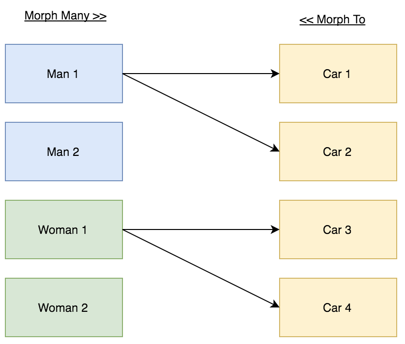

# Many to one relationships(다대일)

# 다대일 관계(**Many to one relationships)**

한 테이블의 두 개 이상의 레코드가 다른 테이블의 한 레코드를 참조하는 것

ex) 한 사람이 두대의 차를 가지고 있다.

두 차가 한 사람을 참조!



## **Foreign Key**

- 테이블의 필드 중 다른 테이블의 레코드를 식별할 수 있는 키
- 각 레코드에서 서로 다른 테이블 간의 관계를 만드는 데 사용

## 게시글과 댓글을 예시로 코드 구현하기!

```python
# articles/models.py

class Comment(models.Model):
		# 외래키 - 단수형(소문자)으로 작성하는 것을 권장
    article    = models.ForeignKey(Article, on_delete=models.CASCADE)
    content    = models.CharField(max_length=200)
    author     = models.ForeignKey(settings.AUTH_USER_MODEL, blank=True, null=True, on_delete=models.CASCADE)
    created_at = models.DateTimeField(auto_now_add=True)
    updated_at = models.DateTimeField(auto_now=True)
```

- on_delete : 참조하는 모델 class가 삭제될 때 연결된 하위 객체의 동작을 결정
- CASCADE : 부모 객체가 삭제 됐을 때 이를 참조하는 객체도 삭제

## 관계 모델 참조

- 역참조
  - 댓글 입장에서는 아티클을 참조하는 상황이 **정참조**
  - N:1관계에서는 1이 N을 참조하는 상황 즉 아티클에게 댓글은 **역참조**
  - 하지만 Article에는 Comment를 참조할 어떠한 필드도 없음
  - 역참조를 하기 위해선 `article.comment_set.all()`
  - N:1관계에서 생성되는 Related manager의 이름은 참조하는 '모델명\_set'이름 규칙으로 만들어짐

## 댓글 구현

### 생성

```python
# articles/forms.py

from .models import Article, Comment

class CommentForm(forms.ModelForm):
    class Meta:
        model  = Comment
        fields = ('content',)
```

```python
# articles/viwes.py

from .forms import ArticleForm, CommentForm

def detail(request, pk):
    article      = Article.objects.get(pk=pk)
    comment_form = CommentForm()
    # 아티클에 달린 모든 댓글 가져오기
    comments     = article.comment_set.all()

    context = {
        'article'     : article,
        'comment_form': comment_form,
        'comments'    : comments
    }
    return render(request, 'articles/detail.html', context)
```

```html
<!-- articles/detail.html -->


<li>
  {{ comment.author }} {{ comment.content }}
  <form
    action=""
    method="POST"
  >
    
    <input type="submit" value="삭제" />
  </form>
</li>

```

```python
# articles/views.py

def comment_create(request, article_pk):
    article      = Article.objects.get(pk=article_pk)
    comment_form = CommentForm(request.POST)

    if comment_form.is_valid():
        # commit=False
        # DB에 저장하지 않고 인스턴스만 반환한다!
        comment         = comment_form.save(commit=False)
        comment.article = article #어떤 글에 댓글을 작성하는건지
        comment.author  = request.user # 어떤 유저가 쓰는건지
        comment.save() # 레코드 저장

        return redirect('articles:detail', article.pk)
    context = {
        'article'     : article,
        'comment_form': comment_form,
    }
    return render(request, 'articles/detail.html', context)
```

### .save(commit=False) 참고

[https://docs.djangoproject.com/en/3.2/topics/forms/modelforms/#the-save-method](https://docs.djangoproject.com/en/3.2/topics/forms/modelforms/#the-save-method)

### 삭제

```python
# articles/urls.py

app_name = 'articles'
urlpatterns = [
      ...,
      path('<int:article_pk>/comments/<int:comment_pk>/delete/', views.comment_delete, name='comment_delete'),
]
```

```python
# articles/views.py

def comment_delete(request, article_pk, comment_pk):
    # 삭제할 댓글
    comment = Comment.objects.get(pk=comment_pk)
    # 삭제
    comment.delete()
    # 본 게시물로 리다이렉트
    return redirect('articles:detail', article_pk)참고ㅁㅁ
```

## 참고

### 댓글 개수 출력

- `{{ comments|length }}`
- `{{ article.comment_set.all|length}}`
- `{{ article.comment_set.count }}`

### 댓글이 없는 경우 대체 컨텐츠 출력

```html
<!-- articles/detail.html -->


<li>
  {{ comment.author }} {{ comment.content }}
  <form
    action=""
    method="POST"
  >
    
    <input type="submit" value="삭제" />
  </form>
</li>

<p>댓글이 없습니다.</p>

```

## 댓글 수정을 구현하지 않는 이유 💥

- 일반적으로 댓글 수정은 수정 페이지로 이동 없이 현재 페이지가 유지된 상태로 댓글 작성 Form부분만 변경되어 수정 할 수 있도록 함
- 이처럼 페이지의 일부 내용만 업데이트 하는 것은 `JavaScript`의 영역
