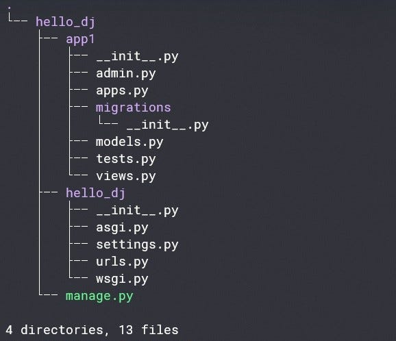
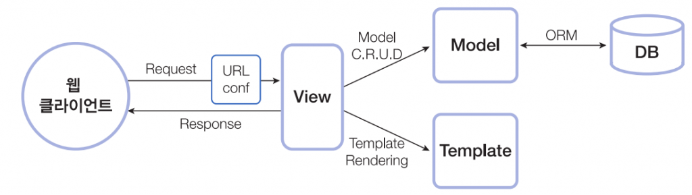

# django 디자인 패턴 - MVT

프로젝트 폴더 구조

# django 프로젝트 구성요소

- 설정 파일(`**settings.py**`)
  - Django 프로젝트의 설정을 포함하고 있으며, 데이터베이스 연결 정보, 정적 파일 경로, 언어 설정 등을 포함
- URLconf(**`urls.py`**)
  - 사용자가 요청한 URL과 매칭되는 뷰를 결정하기 위한 URL 매핑 규칙을 정의
- **`__init__.py`**
  - 애플리케이션을 파이썬 패키지로 인식하도록 하는 역할
- WSGI(Web Server Gateway Interface) 파일(**`wsgi.py`**):
  - 웹 서버와 Django 어플리케이션 사이에서 연결을 돕는 인터페이스를 제공
- ASGI(Asynchronous Server Gateway Interface) 파일(**`asgi.py`**)
  - 비동기식 웹 서버와의 연결 관련 설정
- 앱(Applications)
  - Django 프로젝트 내에서 사용되는 각각의 기능들을 모듈화된 형태로 관리할 수 있는 개별적인 애플리케이션

<aside>
💡 **애플리케이션의 집합(DB, URL, 앱 설정)**

</aside>

# django application

<aside>
💡 MVC(MVT) 패턴에서의 "모델", "뷰", "템플릿"으로 이루어진 기능 **모듈**

</aside>

### 구성 요소

- **`models.py`**
  - 데이터베이스와 관련된 모델 클래스를 정의, 모델은 Django ORM을 사용하여 데이터베이스와 상호작용을 수행
- **`views.py`**
  - 클라이언트 요청에 대한 응답을 처리하는 뷰 함수를 정의, 뷰 함수는 클라이언트로부터 받은 요청을 처리, 모델과 템플릿을 사용하여 응답
- **`templates/`**
  - HTML, CSS, JavaScript, 이미지 파일 등의 프론트엔드 리소스를 담고 있는 템플릿 파일들을 저장
- **`urls.py`**
  - 클라이언트 요청 URL과 뷰 함수를 연결하는 URL 매핑 규칙을 정의
- 하나의 Django 프로젝트에서 여러 개의 Django 어플리케이션을 사용하여 모듈화된 개발을 함.
- 블로그 웹사이트를 개발하는 경우 "게시글", "댓글", "유저", "태그" 등의 Django 어플리케이션을 개별적으로 구성하여 프로젝트에 추가, 이러한 구조는 코드의 **재사용성과 유지보수성을 향상**

# 디자인 패턴

<aside>
💡 소프트웨어 개발에서 공통적으로 발생하는 문제들에 대한 해결책을 일반화하여, **재사용성과 코드의 유지보수성을 높이기 위한** 소프트웨어 설계 방법론

</aside>

# django 디자인 패턴 - MVT

Django는 MVT(Model-View-Template) 디자인 패턴을 사용하여 웹 어플리케이션을 구축

MVT 패턴은 MVC(Model-View-Controller) 패턴과 유사하지만, 컨트롤러가 템플릿으로 대체

MVT 패턴은 각 부분이 독립적, 유지보수 할 때 효율적

### 구성요소

- **Model** : 데이터를 관리하는 부분으로, 데이터베이스와의 상호작용
- **View** : 모델로부터 데이터를 가져와서 템플릿에 전달하고, 사용자가 보는 화면을 제어
- **Template** : 사용자가 보는 화면을 만드는데 사용되는 부분, View에서 전달받은 데이터를 이용해 실제 화면을 구성

# Django에서 template을 인식하는 경로 규칙

app폴더이름 / templates / app폴더이름 / index.html

# \***\*MVT 코딩 순서\*\***

- 무엇을 먼저 코딩해야 하는지에 관해 정해진 순서 x
- 뷰와 템플릿은 서로 영향을 미치므로 독립적으로 개발할 수 있는 **모델을 먼저 코딩**하고 그 후 뷰와 템플릿을 같이 코딩하는 것이 일반적
- **일반적 순서**
  - **프로젝트 뼈대 만들기 :** 프로젝트 및 애플리케이션 프로그래밍에 필요한 디렉터리와 파일 생성
  - **모델 코딩하기 :** 테이블 관련 사항을 프로그래밍(models.py, admin.py 파일)
  - **URLconf 코딩하기 :** URL 및 뷰 매핑 관계를 정의(urls.py 파일)
  - **템플릿 코딩하기 :** 화면 UI 프로그래밍(templates/ 디렉터리 하위의 \*.html 파일들)
  - **뷰 코딩하기 :** 애플리케이션 로직 프로그래밍(views.py 파일)

# 장고는 MVC 구조와 유사한데 왜 MVT라고 부를까?

> 음, 기준이 되는 이름은 논쟁의 여지가 있습니다.
>
> 저희가 MVC를 해석하기로는, “뷰”는 사용자에게 보여지는 데이터들을 설명합니다. 데이터가 “어떻게” 데이터가 “보이는”지가 아니라 “어떤” 데이터를 보여주는지로 볼 수 있습니다. 뷰는 “당신이 어떤 데이터를 보는지” 를 설명하지 “당신이 어떻게 보는지”를 설명하지 않습니다. 이것은 사소한 차이입니다.
>
> 따라서, 우리의 경우 “뷰”는 특정 URL에 대한 파이썬 콜백 함수입니다. 왜냐하면, 콜백함수는 어떤 데이터를 보여주는지 설명하기 때문이죠.
>
> 또한, 내용과 표시를 구분하는 것이 현명합니다. 여기서 템플릿이 등장합니다. **장고에서는 “뷰”는 어떤 데이터를 보여줄지를 구현**합니다. 그러나 뷰는 일반적으로 템플릿에 어떻게 데이터가 보여질 지를 위임합니다.
>
> 그렇다면 “컨트롤러”는 어디에 맞을까요? 장고의 경우, 아마 프레임워크 자체 일것입니다. 프레임워크가 장고 URL설정에 따라 요청을 적절한 뷰에게 전달합니다.
>
> 만약 두문자어를 원한다면, 장고를 “MTV” 프레임워크라고 할수 있습니다. “모델”, “템플릿” 그리고 “뷰”로 말이죠. 이렇게 나누는것이 더 적절합니다.
>
> 결국 효율적으로 작업을 끝낼 수 있습니다. 그리고 어떻게 이름이 붙여지는지 상관없이 장고는 가장 논리적은 방법으로 일을 처리합니다.
>
> 참고:**[장고는 MVC패턴으로 보여집니다, 하지만 컨트롤러를 “뷰”라고 부르고, 뷰를 “템플릿”이라고 합니다. 어떻게 일반적으로 사용하는 이름을 사용하지 않았나요?](https://docs.djangoproject.com/ko/4.1/faq/general/#faq-mtv)**
