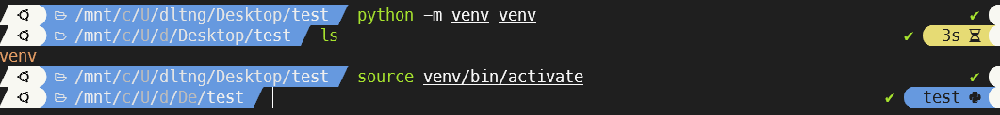
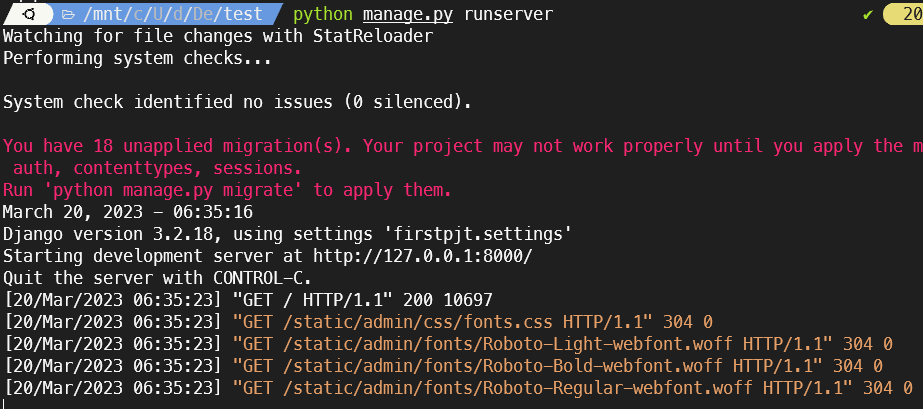
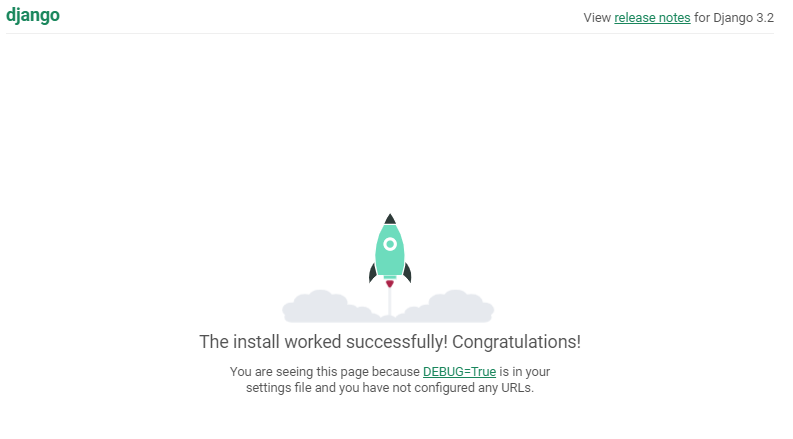

# Django 프로젝트 생성

### 1. 가상환경 설정

```
# 가상환경 생성

python -m venv 가상환경이름
보통 특별한 경우가 아니면 가상환경 이름을 venv로 정한다.
venv 폴더가 생긴다.

# 가상환경 활성화

source 가상환경이름/bin/activate
가상환경 이름을 venv로 정하면 어떤 프로젝트이던지 그 프로젝트 주소로 들어가 같은
명령어로 가상환경을 활성화 할 수 있다.

# 가상환경 비활성화

deactivate
```



### 2. Django 설치

```
# 가장 최신 버전 django 설치

pip install django

# 원하는 버전 django 설치

pip install django==버전명
보통 LTS 버전을 설치한다. Django 공식 홈페이지에서 LTS 버전을 알 수 있다.
(장기 지원되는 버전 -> 안전성)
```

### 3. requirements.txt 생성

requirements.txt는 현재 가상환경에 설치된 라이브러리들을 모두 기록한 파일

```
# requirements.txt 파일 생성

pip freeze > requirements.txt

# requirements.txt에 명시된 라이브러리 설치

pip install -r requirements.txt
```

###

### 4. Django 프로젝트 생성

#

```
# Django 프로젝트 생성

django-admin startproject 프로젝트이름
현재 디렉토리에 프로젝트명으로 된 폴더를 만들고 그 폴더 안에 프로젝트 파일이 담겨져 있다.

django-admin startproject 프로젝트이름 .
현재 폴더에 프로젝트 파일을 생성
```

```
# Django 앱 생성

python manage.py startapp 앱이름
```

### 5. Django 서버 실행

```
# Django 서버 실행

python manage.py runserver

```





### 6. Gitignore 작성

```
# Gitignore 파일 생성

touch .gitignore

[gitignore.io](https://www.toptal.com/developers/gitignore/) 사이트 활용

💥**중요** **gitignore는 git 커밋하기 전에 만들어야 한다!**
```

### 7. Django 앱 생성 및 등록

```
# Django 앱 생성

python manage.py startapp 앱이름

# settings.py 파일에서 앱 등록

INSTALLED_APPS = [
    'articles',
    'django.contrib.admin',
    'django.contrib.auth',
    'django.contrib.contenttypes',
    'django.contrib.sessions',
    'django.contrib.messages',
    'django.contrib.staticfiles',
]

App 등록은 INSTALLED_APPS에서 위부터

1. 생성한 app
2. 서드파티 app(따로 설치한 app)
3. 기본 app

순으로 정렬하는 것이 좋다.
```

INSTALLED_APPS 변수에서 앱을 추가 할때 주의 사항

- settings.py에서 앱을 먼저 등록하고 생성하면 안됨!
- **항상 먼저 앱을 생성하고 이후 등록!**
